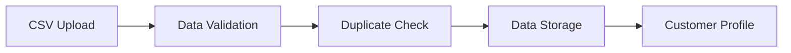
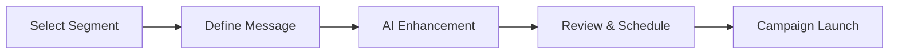
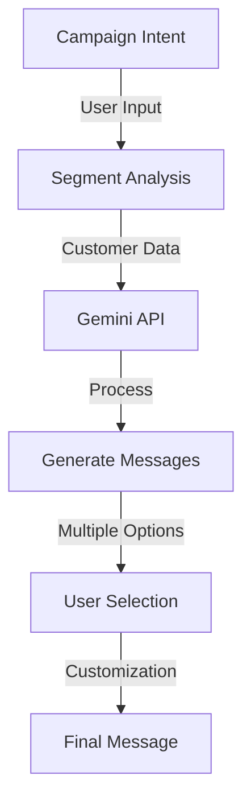

# Mini CRM - Customer Campaign Management Platform

[](https://opensource.org/licenses/MIT)


A modern customer relationship management platformthat helps businesses manage their customer data, create targeted campaigns, and leverage AI for personalized messaging.

## 📚 Table of Contents
- [Overview](#-overview)
- [Quick Links](#-quick-links)
- [Key Features](#-key-features)
- [Technology Stack](#-technology-stack)
- [Project Structure](#-project-structure)
- [Core Workflows](#-core-workflows)
- [Getting Started](#-getting-started)
- [API Documentation](#-api-documentation)
- [AI Integration Details](#-ai-integration-details)
- [Contributing](#-contributing)
- [License](#-license)
- [Future Enhancements](#-future-enhancements)

## 🎯 Overview

This Mini CRM platform is designed to streamline customer communication and campaign management. It enables businesses to:
- Import and manage customer data efficiently
- Create targeted customer segments
- Design and execute personalized campaigns
- Track campaign performance in real-time
- Generate AI-powered message suggestions

## 📑 Quick Links
- [Live Demo](https://minicrm-frontend.onrender.com)
- [Frontend Deployment](https://mini-crm-frontend-ea8x.vercel.app)
- [Backend Deployment](https://minicrm-backend-1.onrender.com)
- [Swagger API Documentation](https://minicrm-backend-1.onrender.com/api-docs/)
- [Backend Repository](https://github.com/rs010101/miniCRM-backend)
- [Frontend Repository](https://github.com/rs010101/miniCRM-frontend)

## ✨ Key Features

### 📊 Customer Data Management
- **Smart Data Import**
  - Bulk import via CSV files
  - Automatic data validation
  - Duplicate detection
  - Data format standardization

### 🎯 Customer Segmentation
- **Rule Builder**
  - Create complex customer segments
  - Combine multiple conditions (AND/OR)
  - Real-time segment preview
  - Save and reuse segments

### 📨 Campaign Management
- **Campaign Creation**
  - Design targeted campaigns
  - AI-powered message generation
  - Schedule campaign delivery
  - Track delivery status

### 📈 Performance Analytics
- **Real-time Tracking**
  - Delivery success rates
  - Customer engagement metrics
  - Campaign effectiveness
  - Segment performance

### 🔐 Security Features
- **Secure Authentication**
  - Google OAuth 2.0 login
  - JWT session management
  - Role-based access control
  - API request validation

## 🛠️ Technology Stack

### 🌐 Frontend
```javascript
{
  "framework": "React",
  "styling": ["Tailwind CSS", "React Icons"],
  "stateManagement": "React Hooks",
  "routing": "React Router",
  "buildTool": "Vite"
}
```

### ⚙️ Backend
```javascript
{
  "runtime": "Node.js",
  "framework": "Express.js",
  "database": "MongoDB with Mongoose",
  "caching": "Redis",
  "authentication": ["JWT", "Google OAuth 2.0"],
  "documentation": "Swagger/OpenAPI"
}
```

### 🤖 AI Integration
```javascript
{
  "provider": "Google Gemini",
  "features": ["Message Generation", "Content Optimization"],
  "integration": "REST API"
}
```

## 🏗️ Project Structure

```bash
miniCRM/
│
├── frontend/                # React frontend application
│   ├── src/
│   │   ├── components/     # Reusable UI components
│   │   ├── pages/         # Main application views
│   │   └── assets/        # Static resources
│   └── public/            # Public assets
│
└── backend/               # Node.js backend application
    ├── src/
    │   ├── apis/         # API routes and controllers
    │   ├── models/       # Database models
    │   ├── services/     # Business logic
    │   └── utils/        # Helper functions
    └── server.js         # Entry point
```

## 🔄 Core Workflows

### 1. Customer Data Management


### 2. Campaign Creation


## 🚀 Getting Started

### 📋 Prerequisites

Make sure you have the following installed before proceeding:

| Requirement | Version | Description |
|------------|---------|-------------|
| Node.js    | v14 or later | JavaScript runtime |
| MongoDB    | v4.4 or later | Database server |
| Redis      | v6.0 or later | Caching server |
| GCP Account | - | With OAuth 2.0 configured |

### 🔧 Backend Setup

1. **Navigate to Backend Directory**
   ```powershell
   cd backend
   ```

2. **Install Dependencies**
   ```powershell
   npm install   # Using npm
   # OR
   yarn install  # Using yarn
   ```

3. **Configure Environment**   Create a `.env` file in the backend directory:
   ```env
   # Server Configuration
   PORT=5000

   # Database Connection
   MONGO_URI=mongodb://localhost:27017/minicrm
   REDIS_URL=redis://localhost:6379

   # Authentication & APIs
   JWT_SECRET=your_strong_jwt_secret_key
   GOOGLE_CLIENT_ID=your_google_oauth_client_id
   GEMINI_API=your_gemini_api_key
   BACKEND_URL=http://localhost:5000
   ```

   > 💡 A `.env.example` file is provided in the repository. Copy it to `.env` and update the values.

4. **Start Development Server**
   ```powershell
   npm run dev
   ```
   
   🎉 Backend should now be running at `http://localhost:5000`

### 🎨 Frontend Setup

1. **Navigate to Frontend Directory**
   ```powershell
   cd frontend
   ```

2. **Install Dependencies**
   ```powershell
   npm install   # Using npm
   # OR
   yarn install  # Using yarn
   ```

3. **Configure Environment**
   Create a `.env` file in the frontend directory:
   ```env
   GOOGLE_CLIENT_ID=your_google_oauth_client_id
   BACKEND_URL=http://localhost:5000
   ```

   > 💡 A `.env.example` file is provided in the repository. Copy it to `.env` and update the values.

4. **Start Development Server**
   ```powershell
   npm run dev
   ```
   
   🎉 Frontend should now be running at `http://localhost:3000`

### 🔍 Verify Setup

1. **Frontend Connection**
   - Open `http://localhost:3000` in your browser
   - You should see the login page

2. **API Documentation**
   - Access complete API documentation at `https://minicrm-backend-1.onrender.com/api-docs`
   - Test API endpoints directly from the documentation

### 🎯 Next Steps

After successful setup, you can:
- Import sample customer data
- Create your first segment
- Design a test campaign
- Explore AI message generation

## 📚 API Documentation

### 🔐 Authentication API

| Endpoint | Method | Description | Request Body | Response |
|----------|--------|-------------|--------------|----------|
| `/auth/login` | POST | User login with credentials | `{ "email": "string", "password": "string" }` | `{ "token": "string" }` |
| `/auth/google` | GET | Google OAuth login | - | Redirects to Google |
| `/auth/refresh` | POST | Refresh access token | `{ "refreshToken": "string" }` | `{ "token": "string" }` |

### 👥 Customer Management

| Endpoint | Method | Description | Request Body | Response |
|----------|--------|-------------|--------------|----------|
| `/customers` | GET | List all customers | Query params for filtering | Array of customers |
| `/customers` | POST | Add new customer | Customer object | Created customer |
| `/customers/:id` | PUT | Update customer | Updated fields | Updated customer |
| `/customers/import` | POST | Bulk import customers | CSV file | Import results |

### 📢 Campaign Operations

| Endpoint | Method | Description | Request Body | Response |
|----------|--------|-------------|--------------|----------|
| `/campaigns` | GET | List all campaigns | Query params for filtering | Array of campaigns |
| `/campaigns` | POST | Create new campaign | Campaign details | Created campaign |
| `/campaigns/:id/launch` | POST | Launch campaign | `{ "scheduledTime": "string" }` | Campaign status |
| `/campaigns/:id/stats` | GET | Get campaign metrics | - | Campaign statistics |

### 🎯 Segment Management

| Endpoint | Method | Description | Request Body | Response |
|----------|--------|-------------|--------------|----------|
| `/segments` | GET | List all segments | - | Array of segments |
| `/segments` | POST | Create segment | Segment rules | Created segment |
| `/segments/:id/preview` | GET | Preview segment members | - | Array of matching customers |

### 🤖 AI Integration

| Endpoint | Method | Description | Request Body | Response |
|----------|--------|-------------|--------------|----------|
| `/ai/generate-message` | POST | Generate campaign message | `{ "context": "string" }` | Generated content |
| `/ai/optimize` | POST | Optimize message | `{ "message": "string" }` | Optimized content |

### 📊 Analytics

| Endpoint | Method | Description | Query Parameters | Response |
|----------|--------|-------------|------------------|----------|
| `/analytics/overview` | GET | Get dashboard stats | Time range | Statistics object |
| `/analytics/campaigns` | GET | Campaign performance | Campaign ID | Performance metrics |

### 🔍 Response Codes

| Code | Description |
|------|-------------|
| 200 | Success |
| 201 | Created |
| 400 | Bad Request |
| 401 | Unauthorized |
| 403 | Forbidden |
| 404 | Not Found |
| 500 | Server Error |

### 🔒 Authentication

All API endpoints except `/auth/*` require a valid JWT token in the Authorization header:

```http
Authorization: Bearer <your_jwt_token>
```

### 📝 API Examples

#### Authentication

```bash
# Google OAuth Login
curl -X POST "http://localhost:5000/api/auth/google" \
  -H "Content-Type: application/json" \
  -d '{"credential": "your_google_credential_token"}'
```

#### Customer Management

```bash
# List Customers
curl -X GET "http://localhost:5000/api/customers" \
  -H "Authorization: Bearer your_jwt_token"

# Import Customers from CSV
curl -X POST "http://localhost:5000/api/customers/import" \
  -H "Authorization: Bearer your_jwt_token" \
  -H "Content-Type: multipart/form-data" \
  -F "file=@customers.csv"
```

#### Campaign Operations

```bash
# Create a New Campaign
curl -X POST "http://localhost:5000/api/campaigns" \
  -H "Content-Type: application/json" \
  -H "Authorization: Bearer your_jwt_token" \
  -d '{
    "name": "Summer Sale 2024",
    "segmentId": "507f1f77bcf86cd799439011",
    "message": "Dont miss our biggest sale!",
    "scheduledTime": "2024-06-01T10:00:00Z"
  }'

# Get Campaign Statistics
curl -X GET "http://localhost:5000/api/campaigns/123/stats" \
  -H "Authorization: Bearer your_jwt_token"
```

#### Segment Rules

```bash
# Create a New Segment
curl -X POST "http://localhost:5000/api/segment-rules" \
  -H "Content-Type: application/json" \
  -H "Authorization: Bearer your_jwt_token" \
  -d '{
    "name": "VIP Customers",
    "conditions": [{
      "field": "totalOrders",
      "operator": "greaterThan",
      "value": 10
    }]
  }'
```

#### Orders

```bash
# Import Orders from CSV
curl -X POST "http://localhost:5000/api/orders/import" \
  -H "Authorization: Bearer your_jwt_token" \
  -H "Content-Type: multipart/form-data" \
  -F "file=@orders.csv"
```

💡 **Tip**: Use the Swagger documentation at `/api-docs` for interactive API testing

## 🤖 AI Integration Details

### Message Generation Flow


### Integration Features
1. **Intent-Based Generation**
   ```javascript
   // Example intent structure
   {
     "intent": "win_back",
     "segmentInfo": {
       "type": "inactive_customers",
       "lastActivity": "> 30 days"
     }
   }
   ```

2. **Message Customization**
   - Personalization tokens
   - Segment-specific content
   - Tone adjustment
   - Length variations

3. **Performance Tracking**
   ```javascript
   // Message effectiveness metrics
   {
     "messageId": "msg_123",
     "metrics": {
       "deliveryRate": "98%",
       "engagement": "45%",
       "clickThrough": "12%"
     }
   }
   ```

## 🤝 Contributing

We welcome contributions to make Mini CRM even better! Here's how you can help:

1. **Fork the Repository**
   - Create your own fork of the code
   - Clone your fork locally

2. **Create a Feature Branch**
   ```powershell
   git checkout -b feature/AmazingFeature
   ```

3. **Make Your Changes**
   - Write your code
   - Follow our coding standards
   - Add tests if applicable
   - Update documentation as needed

4. **Commit Your Changes**
   ```powershell
   git commit -m 'Add some AmazingFeature'
   ```

5. **Push to Your Branch**
   ```powershell
   git push origin feature/AmazingFeature
   ```

6. **Open a Pull Request**
   - Go to the original repository
   - Click "New Pull Request"
   - Select your feature branch
   - Submit the pull request

### Coding Standards
- Follow existing code style
- Use meaningful variable and function names
- Add comments for complex logic
- Ensure all tests pass
- Update documentation

### Need Help?
Feel free to open an issue for:
- Bug reports
- Feature requests
- Questions about the codebase

## 📜 License

This project is licensed under the MIT License - see the [LICENSE](LICENSE) file for details.

## 🔮 Future Enhancements

1. **Enhanced AI Features**
   - Natural language segment rule creation
   - Automated campaign optimization
   - Customer behavior prediction

2. **Advanced Analytics**
   - Real-time campaign tracking
   - Customer journey mapping
   - ROI analytics

3. **Integration Capabilities**
   - Email service providers
   - SMS gateways
   - Social media platforms

4. **Performance Optimization**
   - Message queue implementation
   - Enhanced caching strategies
   - Batch processing for large datasets

