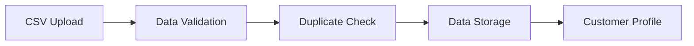
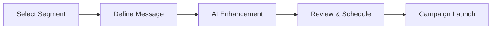
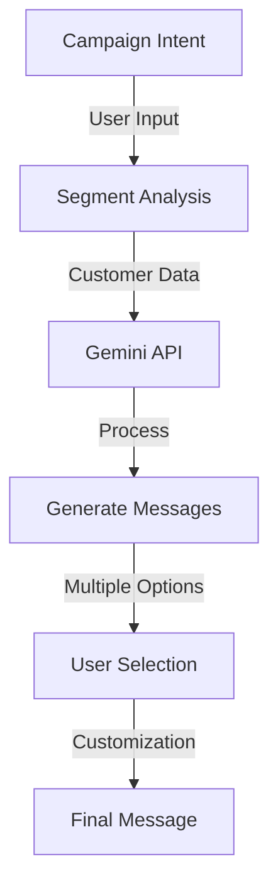

# Mini CRM - Customer Campaign Management Platform

A modern customer relationship management platform that helps businesses manage their customer data, create targeted campaigns, and leverage AI for personalized messaging.

## 🎯 Overview

This Mini CRM platform is designed to streamline customer communication and campaign management. It enables businesses to:
- Import and manage customer data efficiently
- Create targeted customer segments
- Design and execute personalized campaigns
- Track campaign performance in real-time
- Generate AI-powered message suggestions

## 📑 Quick Links
- [Live Demo](https://minicrm-frontend.onrender.com)
- [Frontend Deployment](https://mini-crm-frontend-ea8x.vercel.app)
- [Backend Deployment](https://minicrm-backend-1.onrender.com)
- [Swagger API Documentation](https://minicrm-backend-1.onrender.com/api-docs/)
- [Backend Repository](https://github.com/rs010101/miniCRM-backend)
- [Frontend Repository](https://github.com/rs010101/miniCRM-frontend)

## ✨ Key Features

### 📊 Customer Data Management
- **Smart Data Import**
  - Bulk import via CSV files
  - Automatic data validation
  - Duplicate detection
  - Data format standardization

### 🎯 Customer Segmentation
- **Rule Builder**
  - Create complex customer segments
  - Combine multiple conditions (AND/OR)
  - Real-time segment preview
  - Save and reuse segments

### 📨 Campaign Management
- **Campaign Creation**
  - Design targeted campaigns
  - AI-powered message generation
  - Schedule campaign delivery
  - Track delivery status

### 📈 Performance Analytics
- **Real-time Tracking**
  - Delivery success rates
  - Customer engagement metrics
  - Campaign effectiveness
  - Segment performance

### 🔐 Security Features
- **Secure Authentication**
  - Google OAuth 2.0 login
  - JWT session management
  - Role-based access control
  - API request validation

## 🛠️ Technology Stack

### 🌐 Frontend
```javascript
{
  "framework": "React",
  "styling": ["Tailwind CSS", "React Icons"],
  "stateManagement": "React Hooks",
  "routing": "React Router",
  "buildTool": "Vite"
}
```

### ⚙️ Backend
```javascript
{
  "runtime": "Node.js",
  "framework": "Express.js",
  "database": "MongoDB with Mongoose",
  "caching": "Redis",
  "authentication": ["JWT", "Google OAuth 2.0"],
  "documentation": "Swagger/OpenAPI"
}
```

### 🤖 AI Integration
```javascript
{
  "provider": "Google Gemini",
  "features": ["Message Generation", "Content Optimization"],
  "integration": "REST API"
}
```

## 🏗️ Project Structure

```bash
miniCRM/
│
├── frontend/                # React frontend application
│   ├── src/
│   │   ├── components/     # Reusable UI components
│   │   ├── pages/         # Main application views
│   │   └── assets/        # Static resources
│   └── public/            # Public assets
│
└── backend/               # Node.js backend application
    ├── src/
    │   ├── apis/         # API routes and controllers
    │   ├── models/       # Database models
    │   ├── services/     # Business logic
    │   └── utils/        # Helper functions
    └── server.js         # Entry point
```

## 🔄 Core Workflows

### 1. Customer Data Management


### 2. Campaign Creation


## Getting Started

### Prerequisites
- Node.js (v14 or later)
- MongoDB
- Redis
- Google Cloud Platform account

### Backend Setup

1. Navigate to backend directory:
\`\`\`bash
cd backend
\`\`\`

2. Install dependencies:
\`\`\`bash
npm install
\`\`\`

3. Create .env file:
\`\`\`env
PORT=5000
MONGO_URI=your_mongodb_uri
REDIS_URL=your_redis_url
GOOGLE_CLIENT_ID=your_google_client_id
JWT_SECRET=your_jwt_secret
\`\`\`

4. Start the server:
\`\`\`bash
npm run dev
\`\`\`

### Frontend Setup

1. Navigate to frontend directory:
\`\`\`bash
cd frontend
\`\`\`

2. Install dependencies:
\`\`\`bash
npm install
\`\`\`

3. Create .env file:
\`\`\`env
REACT_APP_API_URL=http://localhost:5000
REACT_APP_GOOGLE_CLIENT_ID=your_google_client_id
\`\`\`

4. Start the development server:
\`\`\`bash
npm start
\`\`\`

## API Documentation

The API is documented using Swagger. Once the backend is running, visit:
\`http://localhost:5000/api-docs\`

### Key Endpoints:

- **Authentication**
  - POST /api/auth/google - Google OAuth login
  
- **Customers**
  - GET /api/customers - List all customers
  - POST /api/customers - Upload customer data
  
- **Campaigns**
  - GET /api/campaigns - List campaigns
  - POST /api/campaigns - Create campaign
  - GET /api/campaigns/:id/stats - Get campaign stats
  
- **Segments**
  - GET /api/segment-rules - List segment rules
  - POST /api/segment-rules - Create segment rule
  - GET /api/segment-rules/:id/customers - Get customers in segment

## 🤖 AI Integration Details

### Message Generation Flow


### Integration Features
1. **Intent-Based Generation**
   ```javascript
   // Example intent structure
   {
     "intent": "win_back",
     "segmentInfo": {
       "type": "inactive_customers",
       "lastActivity": "> 30 days"
     }
   }
   ```

2. **Message Customization**
   - Personalization tokens
   - Segment-specific content
   - Tone adjustment
   - Length variations

3. **Performance Tracking**
   ```javascript
   // Message effectiveness metrics
   {
     "messageId": "msg_123",
     "metrics": {
       "deliveryRate": "98%",
       "engagement": "45%",
       "clickThrough": "12%"
     }
   }
   ```

## 🔮 Future Enhancements

1. **Enhanced AI Features**
   - Natural language segment rule creation
   - Automated campaign optimization
   - Customer behavior prediction

2. **Advanced Analytics**
   - Real-time campaign tracking
   - Customer journey mapping
   - ROI analytics

3. **Integration Capabilities**
   - Email service providers
   - SMS gateways
   - Social media platforms

4. **Performance Optimization**
   - Message queue implementation
   - Enhanced caching strategies
   - Batch processing for large datasets

